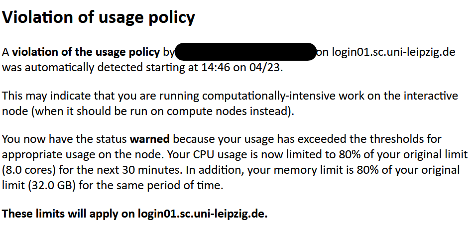

# Enjoy Slurm or: How I Learned to Stop Worrying and Love the Cluster
Date: Oktober 4th, 2023


## Login

Scientific computing team Leipzig is present here: [Scientific Computing](https://www.sc.uni-leipzig.de/). Here you can also request access to the infrastructure. 

The default queueing system is done by Slurm. Hardware ressources are listed in [Hardware resource overview](https://www.sc.uni-leipzig.de/02_Resources/Hardware/). If you want to use the clusters with Jupyter or RStudio, you can do so, too. This course is only about using slurm. Also have in mind, that the console application from the jupyter lab is not running on the login node. So you have to strictly access through SSH.

To access the system you login to one of the login nodes: `login0X.sc.uni-leipzig.de`.

- login 1: 1 Tesla V100 and 1 GeForce RTX 2080 Ti, specialized for clara jobs
- login 2 and 3: cpu only
- login 4: 2 x NVIDIA A30 which is optimized for jobs on paul or paula.

You should consider using your SSH key and the SSH confiog file for easier logins. THen it can be as easy as:

```bash
$ ssh sclogin1
Welcome to

   _____           ______
  / ___/          / ____/
  \__ \          / /
 ___/ /         / /___
/____/cientific \____/omputing


Next maintenance: 2023-10-11 8:00 CEST until 2023-10-13 16:00 CEST

Documentation for this system can be found at https://www.sc.uni-leipzig.de/

Please submit service requests to sc-request@uni-leipzig.de

Last login: Mon Oct  2 10:50:30 2023 from 172.24.99.100
$
```

Do not run computationally expensive things on the login nodes. Otherwise you'll get a warning on your login and you might loose your access rights or get limitations. This looks like this:



## Software

The software is centrally managed. Go for `lmod` to access more software:

- `module avail`
- `module load`
- `module purge`

Most software packages should be installed through `lmod` already. Just activate it like this:

```bash
$ julia --version
zsh: command not found: julia
$ module avail julia

------------------------------------------- /software/modules/all -------------------------------------------
   Julia/1.7.2-linux-x86_64    Julia/1.9.1-fixed-depot-path-linux-x86_64    Julia/1.9.3-linux-x86_64 (D)
   Julia/1.8.5-linux-x86_64    Julia/1.9.1-linux-x86_64

------------------------------------------ /software/modules/lang -------------------------------------------
   Julia/1.7.2-linux-x86_64    Julia/1.9.1-fixed-depot-path-linux-x86_64    Julia/1.9.3-linux-x86_64
   Julia/1.8.5-linux-x86_64    Julia/1.9.1-linux-x86_64

----------------------------------------- /software/modules/staging -----------------------------------------
   all/Julia/1.8.5-linux-x86_64                         lang/Julia/1.8.5-linux-x86_64
   all/Julia/1.9.1-fixed-depot-path-linux-x86_64        lang/Julia/1.9.1-fixed-depot-path-linux-x86_64
   all/Julia/1.9.1-linux-x86_64                         lang/Julia/1.9.1-linux-x86_64
   all/Julia/1.9.3-linux-x86_64                  (D)    lang/Julia/1.9.3-linux-x86_64                  (D)

  Where:
   D:  Default Module

$ module load Julia
$ julia --version
julia version 1.9.3
$ module purge Julia
$ julia --version
zsh: command not found: julia
$
```

Installing locally is also a possibility

- R: `install.packages("remeta", lib="~/R/", repos="http://cran.r-project.org")`
- Python: `pip install --user <packagename>` (Please use virtual environments of any kind for python packages)

## File Systems and storage

There are no quotas and no backups at this point as far as I know. But this is still open to discussion. Actuallly theree was an email some time ago:

> Hello xxxxxxxxxxxxx
>
> We had a hardware defect, which led to a data loss even though the data is stored redundantly. Unfortunately, your /work data is also affected by this.
> 
> Please find attached an overview of your data that is no longer available.
> We apologize for the inconvenience. We are still in the process of determining the cause of the outage. At the moment we have to assume that the data is lost, but we are still investigating options for recovery.
> 
> With kind regards
>
> Team SC
>
> PS: If you have any questions, please do not reply to this mail. Instead, contact us at sc-request@uni-leipzig.de

The following file systems are available:

| Name | Location | Data Access | Speed | Size (roughly) | Notes | Best use case |
| :--- | :------- | :---------- | :---- | :--- | :---- | :---- |
| home | `/home/sc.uni-leipzig.de/<scuser>` | from any node | ? | small | quotas unknown | small files, configuration files, scripts |
| work | `/work/users/<scuser>` | from any node | Optimized for large file access | very large | There might be extensions in case it's full regularly | large files, data, results |
| scratch | `/lscratch` | on each individual node | very fast (nvme drives) | shared 3.5 TB (02.10.2023) | not sure about automatic cleanups | temporary files, intermediate results, cache |

You can copy/paste files from your local machine to the cluster via `scp` or `rsync`. You can also mount the home directory via `sshfs` or `smb` (Windows).

In case you want to share data or work, use ACLs (online tutorials available). Otherwise better use the following to secure everything from others:

```bash
chmod -R 700 /work/users/<sc~username>
chmod -R 700 /home/sc.uni-leipzig.de/<sc~username>
```
